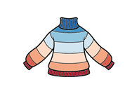

# Homes, Heat and Healthy Kids Lothian Cohort (H3K Lothian) 

## Background
Cold, damp homes are associated with acute respiratory infections (ARIs) in preschool children. New data infrastructure in Scotland now permits linkage between healthcare data and individual properties, creating opportunities to explore this association in more detail. 

## Objective 
The Homes, Heat, and Healthy Kids Lothians Cohort (H3K Lothian), will be established as an exploratory and developmental dataset within the wider Homes, Heat and Healthy Kids (H3K) programme. The aims are to develop and refine data linkage and cohort construction, finalise outcome definitions, develop infrastructure for multilevel count models and latent state models and examine associations between property energy efficiency and burden of acute respiratory infections. 
## Methods 
We will construct a de-identified birth cohort of all children under 5 years old born in the NHS Lothian region from 01/01/2012 - 31/12/24. We will link birth records with property level energy efficiency data, hospital admissions, GP attendances, prescriptions, prepayment smart meter data, environmental and climate data. The cohort database will be held in, and accessed via, the DataLoch Trusted Research Environment.
Descriptive statistics will be produced for the cohort over time. Multi-level models will explore the association between ARIs counts and home energy efficiency. Finally, we will develop a hidden Markov model to explore changes in the state of respiratory children‘s respiratory health with reference to the energy efficiency of their home. 

## Github Files
Various files relating to analysis of DataLoch data including:
1. [Code List](code_list.csv) - lists of ICD 10 and Read V2 codes identifying different conditions
2. [build_phenotype_lists](code_updates\building_phenotype_list.ipynb) - colab notebook used to build the codelist from HDRUK codelists - identifies codelist and any further data manipulation
3. [analysis plan](analysis_plan.md) - graph setting out plan for analysis of DataLoch data
4. [data linkage](linkage_plan.md) - file showing linkage of DataLoch data
5. [healthcare process](healthcare_process.md) - file showing how a hospital admission record from SMR01 is assigned to particular categories of disease (chronic or Acute Respiratory Infection) before being combined into an extended episode
6. [Data Dictionary](DataLoch_Data_Dictionary.csv) - file showing the tables and fields that are available in the DataLoch environment with notes

## Code_list.csv

Code list that combines chronic paediatric conditions from harmonised code lists with code lists defining the Acute Respiratory Infections. The two lists are separated by the field “Phenotype_category.” The “code” field includes both ICD-10 (with dots removed) and 7‑character Read V2 codes. If you’d like a de‑duplicated view within each phenotype_category, just filter to rows where Rank = 1.

### Columns:

* *Phenotype_category* — "Acute Respiratory Infection" or "Chronic Paediatric Condition"
* *Code* — ICD10 code (no “.”) or 7‑character Read V2 code
* *Description* — text description of the code
* *Code_system* — indicates code system used in *Code* field - contains either "ICD10 codes" or "Read V2 codes"
* *Clinical_subcategory* — further sub‑categorisation of the phenotype (e.g. "Other neurological - cerebral palsy and paralysis", "Other neurological - neurological devices")
* *Phenotype_name* — name of the phenotype (e.g. "Wheezing", "Transplant", "Other neurological", etc.)
* *Rank* — 1 or 2 (use Rank = 1 for a unique list within each phenotype_category)

## Conclusion 
The Homes, Heat, and Healthy Kids CohortH3K Lothian will link administrative health data to longitudinal property level and environment exposures for the first time, and lay the groundwork for causal epidemiological analysis in a national dataset. 

## Authors and Acknowledgements
* Olivia Swann1, 4    
* Tim Wilding 1 
* Caroline Fyfe 2 
* Hannah Law 1
* Eleanor Harrison 1,3 

1. Centre for Medical Informatics, Usher Institute, University of Edinburgh 
2. School of Geosciences University of Edinburgh 
3. School of Informatics, University of Edinburgh 
4. Department of Child Life and Health, University of Edinburgh 
