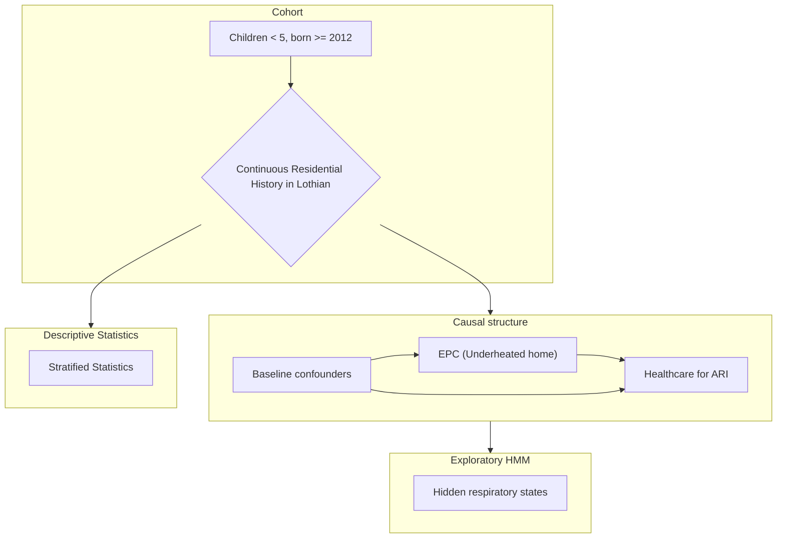

Analysis Plan:

```mermaid
flowchart TD
  %% Establish cohort
  subgraph A [Cohort]
    A1[Children < 5, born >= 2012]
    A2{Continuous Residential History in Lothian}
    A1 --> A2
  end

  %% Causal structure
  subgraph B [Causal structure]
    X["EPC (Underheated home)"]
    Y[Healthcare for ARI]
    C[Baseline confounders]
    X --> Y
    C --> X
    C --> Y
  end

  %% Analysis branches
  %% subgraph Cx [Natural experiments / DiD]
  %%   E0[House move event]
  %%   E1[Event-study DiD]
  %%   E0 --> E1
  %% end

  subgraph D [Exploratory HMM]
    H1[Hidden respiratory states]
  end

  subgraph E [Descriptive Statistics]
   H2[Stratified Statistics]
  end

  %% Flow
  A2 --> B
  %% B --> Cx
  B --> D
  A2 --> E

  classDef exp fill:  #E6C7AF,color:#fff,stroke:#1b9e77,stroke-width:1px;
  classDef conf fill: #86AFC4,color:#fff,stroke:#377eb8,stroke-width:1px;
  classDef med fill: #D96A4C,color:#fff,stroke:#ff7f00,stroke-width:1px;

 %% class Cx,D,E med
 %% class A conf
 %% class B exp
```