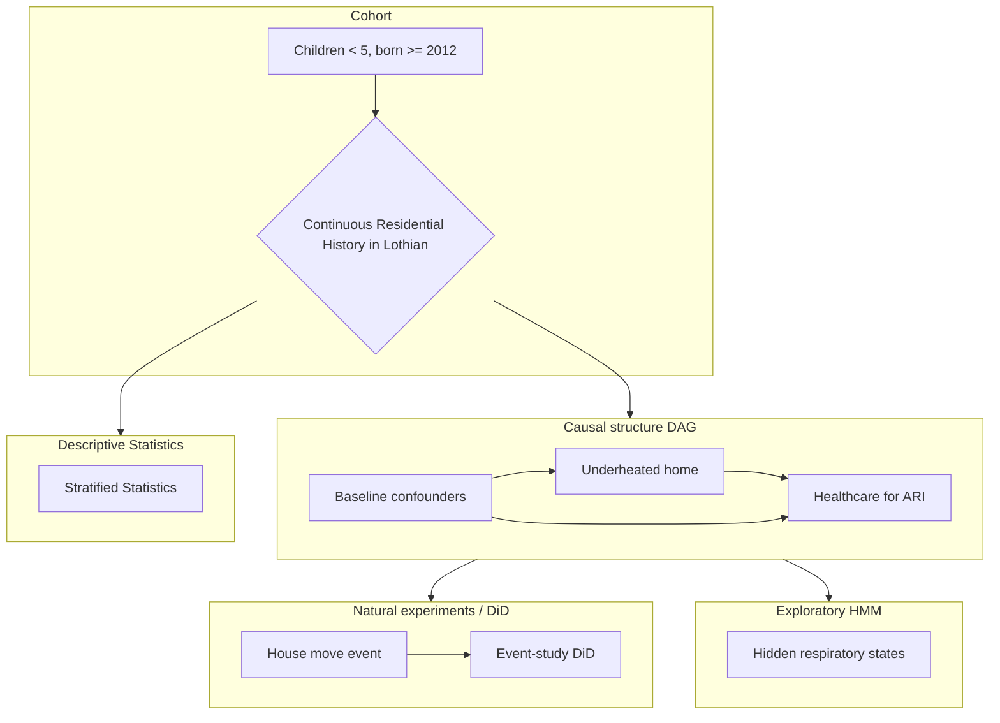

Proposed Analysis Plan:

```mermaid
flowchart TD
  %% Establish cohort
  subgraph A [Cohort]
    A1[Children < 5, born >= 2012]
    A2{Continuous Residential History in Lothian}
    A1 --> A2
  end

  %% Causal structure
  subgraph B [Causal structure DAG]
    X[Underheated home]
    Y[Healthcare for ARI]
    C[Baseline confounders]
    X --> Y
    C --> X
    C --> Y
  end

  %% Analysis branches
  subgraph Cx [Natural experiments / DiD]
    E0[House move event]
    E1[Event-study DiD]
    E0 --> E1
  end

  subgraph D [Exploratory HMM]
    H1[Hidden respiratory states]
  end

  subgraph E [Descriptive Statistics]
    H2[Stratified Statistics]
  end

  %% Flow
  A2 --> B
  B --> Cx
  B --> D
  A2 --> E

  classDef exp fill:#1b9e77,color:#fff,stroke:#1b9e77,stroke-width:1px;
  classDef conf fill:#377eb8,color:#fff,stroke:#377eb8,stroke-width:1px;
  classDef med fill:#ff7f00,color:#fff,stroke:#ff7f00,stroke-width:1px;
  classDef out fill:#e41a1c,color:#fff,stroke:#e41a1c,stroke-width:1px;
  classDef note fill:#f0f0f0,stroke:#999,stroke-width:1px,color:#333;
```