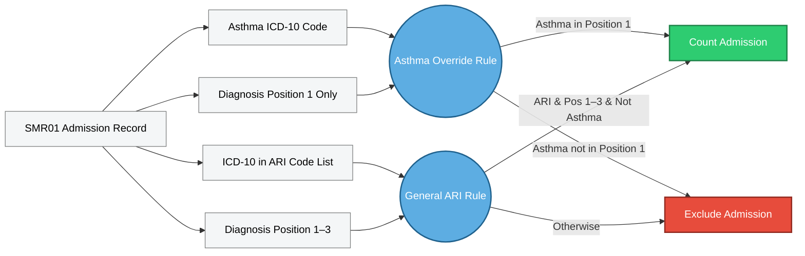

```mermaid
flowchart LR

    %% =========================
    %% Observed Variables
    %% =========================
    A[SMR01 Admission Record]
    B[ICD-10 in ARI Code List]
    C[Diagnosis Position 1–3]
    D[Diagnosis Position 1 Only]
    E[Asthma ICD-10 Code]

    %% =========================
    %% Rule Nodes (Deterministic)
    %% =========================
    R1((General ARI Rule))
    R2((Asthma Override Rule))

    %% =========================
    %% Outcomes
    %% =========================
    Y[Count Admission]
    N[Exclude Admission]

    %% =========================
    %% Causal Structure
    %% =========================

    A --> B
    A --> C
    A --> D
    A --> E

    %% General ARI pathway
    B --> R1
    C --> R1

    %% Asthma override pathway
    E --> R2
    D --> R2

    %% Override logic
    R2 -->|Asthma in Position 1| Y
    R2 -->|Asthma not in Position 1| N

    %% General rule applies only if not Asthma
    R1 -->|ARI & Pos 1–3 & Not Asthma| Y
    R1 -->|Otherwise| N

    %% =========================
    %% Styling
    %% =========================
    classDef include fill:#2ecc71,color:#ffffff,stroke:#1e8449,stroke-width:2px;
    classDef exclude fill:#e74c3c,color:#ffffff,stroke:#922b21,stroke-width:2px;
    classDef rule fill:#5dade2,color:#ffffff,stroke:#1f618d,stroke-width:2px;
    classDef data fill:#f4f6f7,color:#000000,stroke:#7b7d7d,stroke-width:1px;

    class Y include
    class N exclude
    class R1,R2 rule
    class A,B,C,D,E data
```