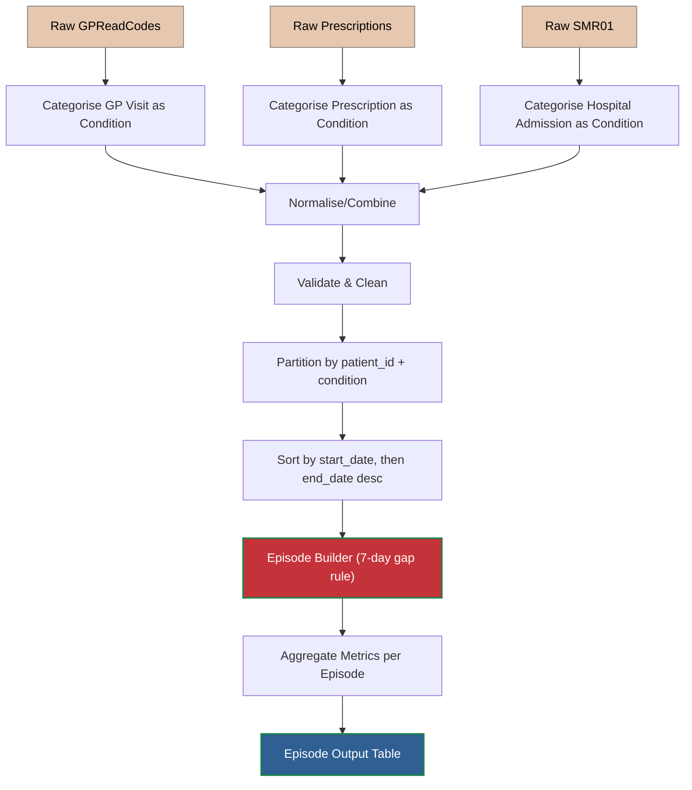
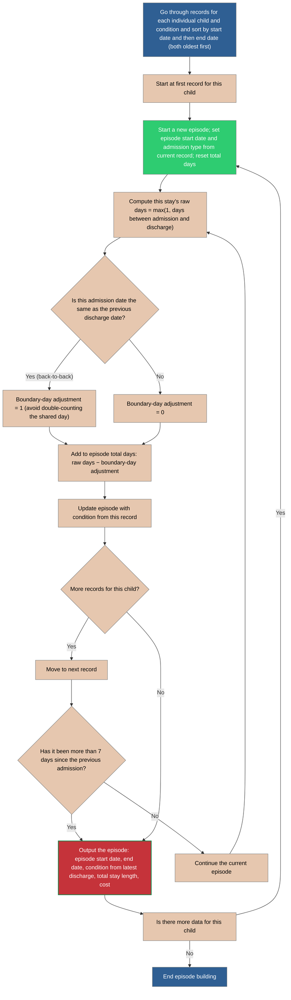
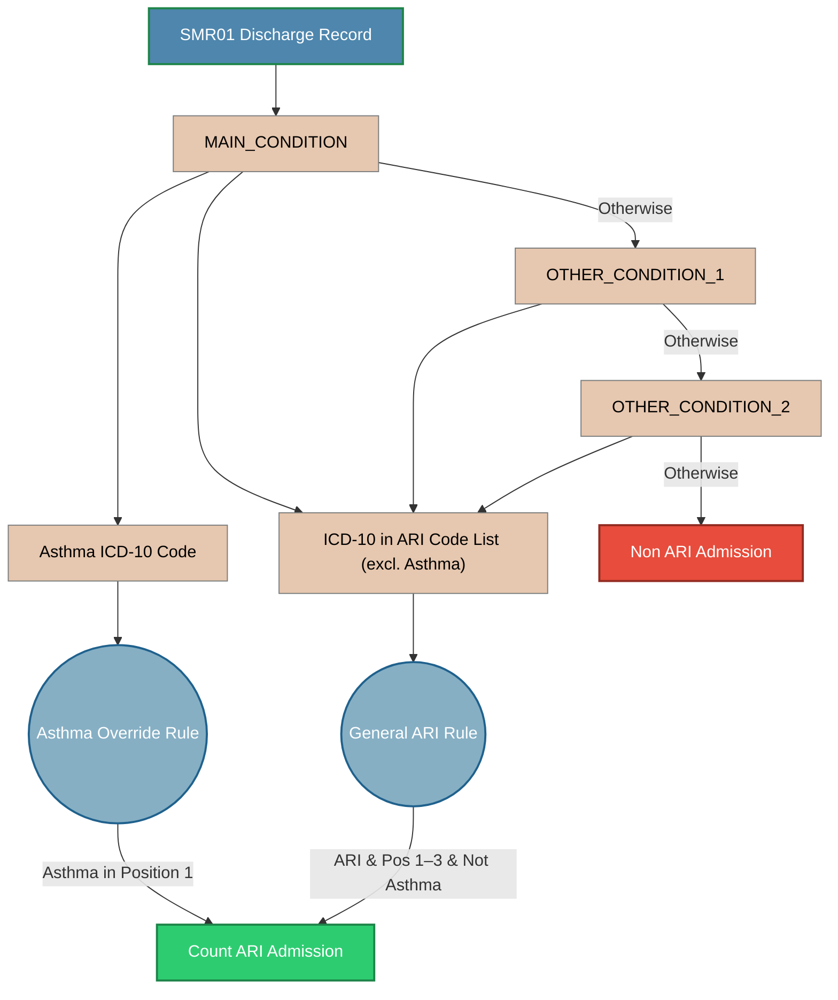
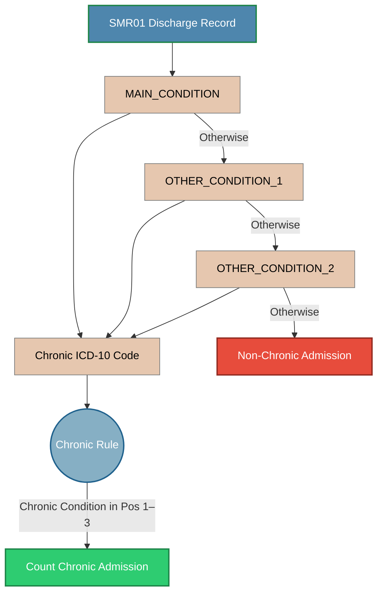
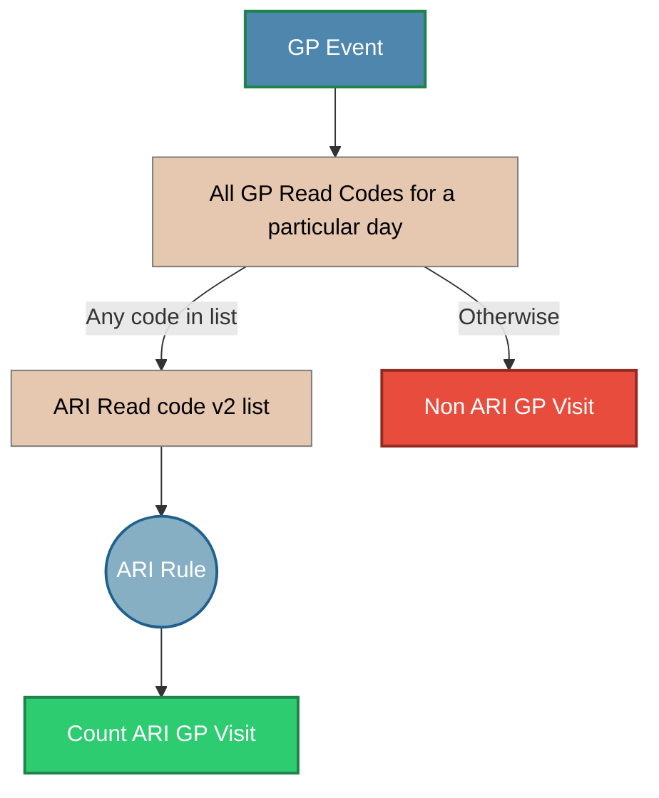
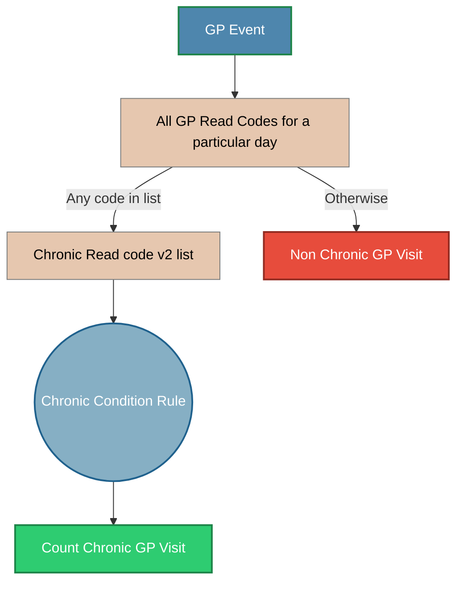

# Assignment of Healthcare Records
This document deals with the assignment of healthcare records to a particular condition. There are three input tables of healthcare records:
1. **SMR01** - Hospital Admission Records
        - patient_id, condition_codes, admission_date, discharge_date
2. **GPReadCodes** - GP Read codes after GP attendance
        - patient_id, Read code, visit_date
3. **Prescriptions** - Each prescription of Salbutamol, Clarithromycin, or Amoxicillin
        - patient_id, prescription_name, dispensed_date

## High-level process

**Normalisation**: Convert input tables into a single Healthcare Events table with unified schema:
*   patient_id 
*   condition_code - what is this code? is it clinical_subcategory?
*   event_type ∈ {GP, RX, ADM}
*   event_start_date, event_end_date (for GP and RX, end = start, for hospital admission, end = discharge date)
*   cost 
*   optional: prescription_id, drug_code, admission_id

## Episode Builder
There are many events that are close together. For example, hospital admissions often show multiple admissions for a single child. Events will be considered a single Episode if there is a previous event within the last 7 days. The first event date will be the date when the episode is considered to have occurred. Total Day count will be summed up for the overlapping records. Diagnosis codes will not necessarily be the same for the different admissions, but they will be considered to be the same condition (clinical subcategory?). The diagnosis codes will be the diagnosis codes for the last discharge record. 
**Goal**: Group events of the same patient and same condition into episodes, where any gap between consecutive events in an episode is at most max_gap_days (default 7). Episodes can be longer than 7 days; the 7 days limit applies to the gap between events, not the total episode length.
### Events:
*    GP visit: single-day event.
*    Prescription: single-day event with a cost and product identifier.
*    Hospital admission: multi-day event with start_date and end_date.
 
Episode outputs per patient + condition:
*   episode_start_date, episode_end_date
*   gp_visit_count
*   hospital_days_total
*   prescription_count
*   prescription_cost_total
*   Optional: hospital_admissions_count, distinct_prescription_count, list of prescription types

### Key Business Rules

**Partitioning**: Build episodes independently per patient_id and condition_code.
**Gap rule**: A new event belongs to the current episode if event.start_date <= current_episode_end + max_gap_days. Otherwise, close the episode and start a new one. Default max_gap_days = 7.
**Episode window expansion**: When adding an event, extend current_episode_end = max(current_episode_end, event.end_date). Hospital admissions can extend episodes forward.
**Same-day/back-to-back**:
*   If event start date <= current episode end, it is within the episode (overlap).
*   If event start date is exactly current episode end + 1 (.e., no full-day gap), still within episode because gap = 1 <= 7.

**Hospital day counting**:
* Parameter day_count_mode:
        inclusive_days: hospital_days = (end_date - start_date) + 1
            nights_only: hospital_days = (end_date - start_date)
* Costs: Sum per prescription record’s cost within the episode. 

### Combining Admissions
Flow chart showing how to combine hospital admissions.

### Categorising Admissions
Hospital Admissions will be categorised in two ways:
i) Acute Respiratory Infection 
ii) Chronic Conditions
A record will be categorised in two ways and will potentially be double-counted.

### Acute Respiratory Infections
The flow chart below shows how an individual SMR01 record is assigned to a particular category of Acute Respiratory Infection. The contract states that: 

>a) Admission with ARI
HDR-UK phenotype code lists will be used. 
>
>i)	Lower respiratory tract infections:
https://phenotypes.healthdatagateway.org/phenotypes/PH488/version/1521/detail/ 
>
>ii)	Upper respiratory tract infections: https://phenotypes.healthdatagateway.org/phenotypes/PH158/version/316/detail/ 
>
>iii)	In addition, to ensure we include children presenting with viral induced wheeze (for which there is no ICD-10 code), we will also include the following ICD-10 codes (as previously published in (1)).
>-	R06.2	Wheezing
>-	R06.0	Dyspnoea
>-	R06.8	Other abnormalities of breathing
>
>The ICD-10 codes outlined above will be included if present in diagnosis positions 1-3. 
>iv)	In young children, there is no simple distinction between viral induced wheeze and asthma. As such, we will also include children admitted with asthma as viral infection is predominant trigger in this age group. The following ICD-10 codes will be included:
>-	J45 	Asthma
>-	J46 	Status asthmaticus
> 
>These asthma ICD-10 codes will only be included if present in diagnosis position 1. This will ensure only admissions directly due to asthma are included and avoid including historical diagnoses of asthma (i.e., excluding asthma if only present as a comorbidity).

These lists have been replaced by an ARI code list that contains ICD-10 codes for a variety of Respiratory Infections. The ARI code list contains lists of ICD10 codes for chronic conditions and a list of ICD10 codes for Acute Respiratory Infections. Each ICD10 code has a phenotype name and a clinical subcategory associated with it. The General ARI rule will assign the hospital admission to one of three phenotypes:
 - Ear and Upper Respiratory Tract Infections
 - Lower Respiratory Tract Infection
 - Wheezing

The Asthma Override rule will assign the hospital admission to the "Acute Asthma" phenotype. A hospital admission will only be assigned to one particular phenotype.

### Chronic Conditions

Separately, an SMR01 admission record is categorised as a chronic condition using the following flowchart. The record is assigned to the phenotype name and clinical subcategory associated with the ICD10 code. This should work more as children being assigned to conditions

## Categorising GP Records

We will consider multiple GP read codes on a single day to be a single event. The multiple codes may affect how a GP visit is categorised. GP Visits, prescriptions and hospital admissions will all be considered separately for the analysis.

The vast majority of GP visits are categorised by a single Read code v2 value. However, like hospital admissions, GP Visits will be categorised in two ways. GP read codes do not have a hierarchy of visits so we cannot distinguish between a main code and secondary codes. First, we will test whether the visit to the GP is for an Acute Respiratory Infection. 

### Acute Respiratory Infections

If multiple GP read code v2 match ARIs on a particular day, then we will assign the ARI using the first record in the file for a particular child on a particular day. 

### Chronic Conditions

If multiple GP read code v2 match Chronic conditions on a particular day, then we will assign the Chronic Condition using the first record in the file for a particular child on a particular day. 
