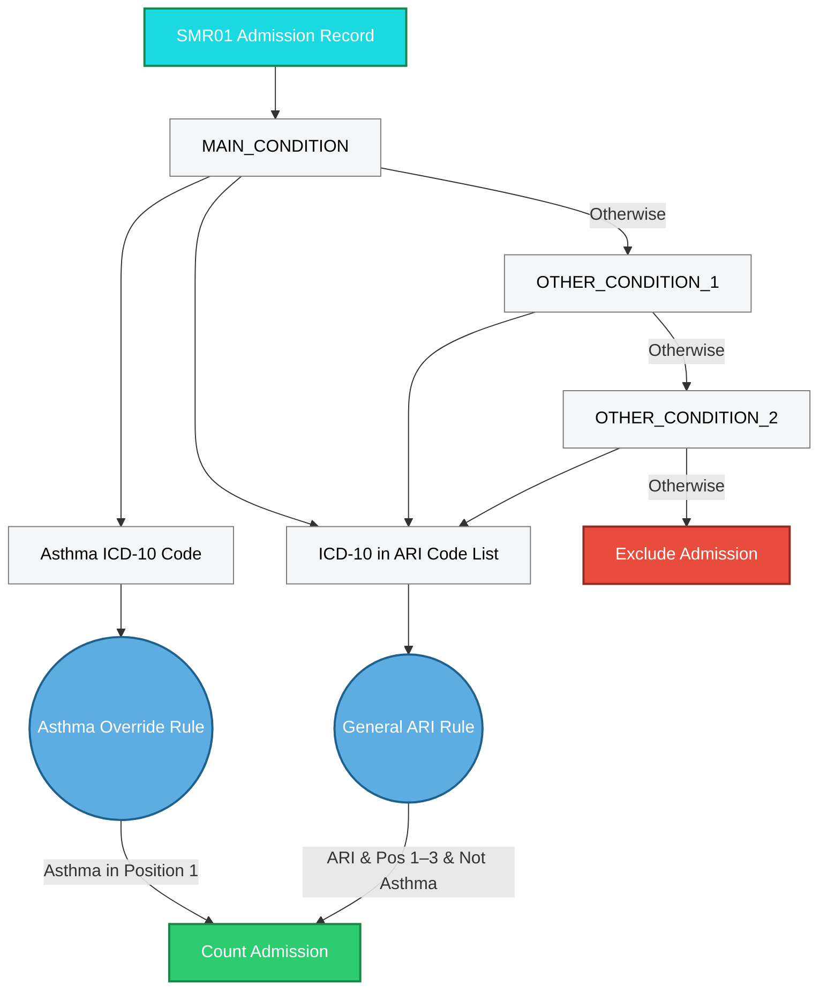
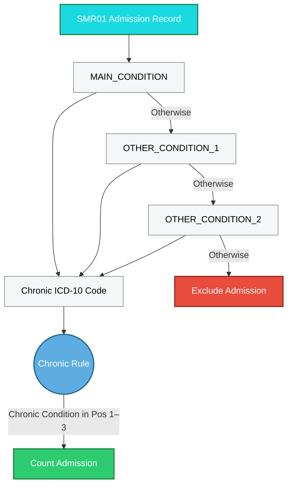

# Assignment of Hospital Admission Records
Hospital admissions often show multiple admissions for a single child Admissions will be considered a single admission if a previous admission within the last 7 days. Total Day count will be summed up for the overlapping records. Diagnosis codes will not necessarily be the same for the different admissions. The diagnosis codes will be the diagnosis codes for the last record. 

## Acute Respiratory Infections
The flow chart below shows how an individual SMR01 record is assigned to a particular category of Acute Respiratory Infection. The contract states that: 

>Any admission with ICD-10 codes outlined in the Acute Respiratory Infection code list will be counted if the ICD-10 codes are present in diagnosis positions 1-3 of the hospital admission record in SMR01. For an asthma admission, the ICD-10 code must only appear in diagnosis position 1. This will exclude diagnoses where asthma is only present as a comorbidity.

## Chronic Conditions

Separately, an SMR01 admission record is categorised as a chronic condition using the following flowchart.

