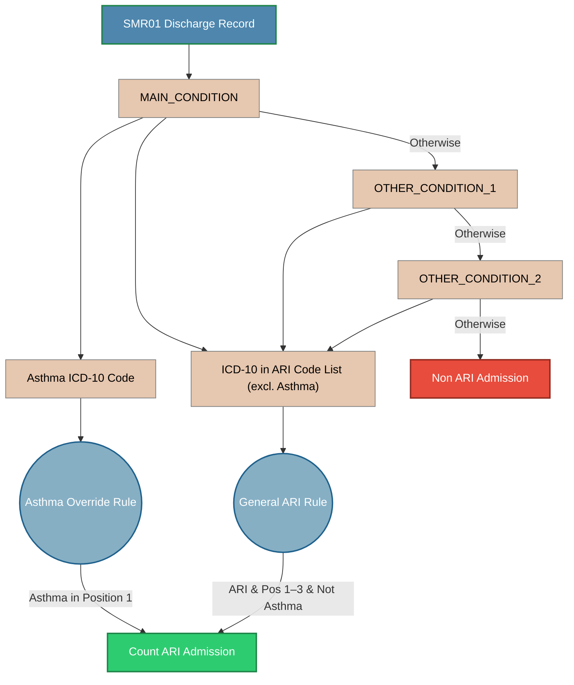
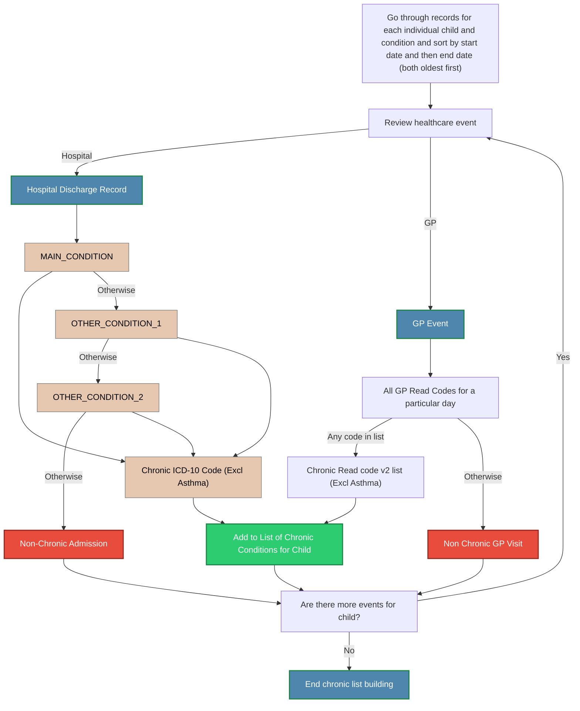
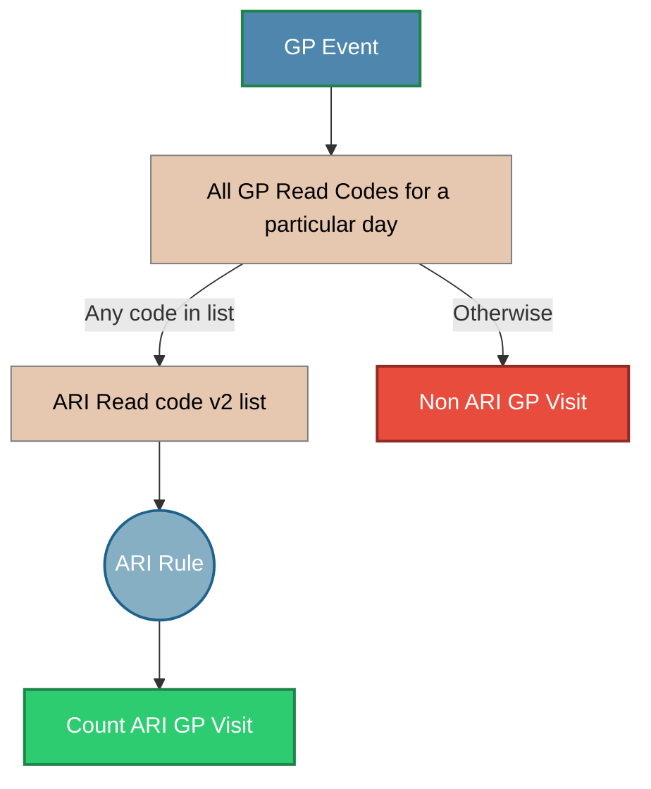

# Categorising Admissions
Hospital Admissions will be categorised in two ways:
i) Acute Respiratory Infection 
ii) Chronic Conditions
A record will be categorised in two ways and will potentially be double-counted.

### Acute Respiratory Infections
The flow chart below shows how an individual SMR01 record is assigned to a particular category of Acute Respiratory Infection. The contract states that: 

>a) Admission with ARI
HDR-UK phenotype code lists will be used. 
>
>i)	Lower respiratory tract infections:
https://phenotypes.healthdatagateway.org/phenotypes/PH488/version/1521/detail/ 
>
>ii)	Upper respiratory tract infections: https://phenotypes.healthdatagateway.org/phenotypes/PH158/version/316/detail/ 
>
>iii)	In addition, to ensure we include children presenting with viral induced wheeze (for which there is no ICD-10 code), we will also include the following ICD-10 codes (as previously published in (1)).
>-	R06.2	Wheezing
>-	R06.0	Dyspnoea
>-	R06.8	Other abnormalities of breathing
>
>The ICD-10 codes outlined above will be included if present in diagnosis positions 1-3. 
>iv)	In young children, there is no simple distinction between viral induced wheeze and asthma. As such, we will also include children admitted with asthma as viral infection is predominant trigger in this age group. The following ICD-10 codes will be included:
>-	J45 	Asthma
>-	J46 	Status asthmaticus
> 
>These asthma ICD-10 codes will only be included if present in diagnosis position 1. This will ensure only admissions directly due to asthma are included and avoid including historical diagnoses of asthma (i.e., excluding asthma if only present as a comorbidity).

These lists have been replaced by an ARI code list that contains ICD-10 codes for a variety of Respiratory Infections. The ARI code list contains lists of ICD10 codes for chronic conditions and a list of ICD10 codes for Acute Respiratory Infections. Each ICD10 code has a phenotype name and a clinical subcategory associated with it. The General ARI rule will assign the hospital admission to one of three phenotypes:
 - Ear and Upper Respiratory Tract Infections
 - Lower Respiratory Tract Infection
 - Wheezing

The Asthma Override rule will assign the hospital admission to the "Acute Asthma" phenotype. A hospital admission will only be assigned to one particular phenotype.

### Chronic Conditions
Each child will be listed as having one or more chronic conditions. Asthma will not be included in the list of chronic conditions. The following table will be built up per patient:

**Normalisation**: Convert healthcare events to a list of chronic conditions for each child:
* **ppid** - Unique child ID
* **chronic_condition** - phenotype_name from chronic conditions list

Separately, healthcare events are categorised as a chronic condition using the following flowchart. The record is assigned to the phenotype name and clinical subcategory associated with the ICD10 code. This should work more as children being assigned to conditions

## Categorising GP Records

- Most GP visits are recorded with a single Read v2 code. Unlike hospital admissions, GP Read codes don’t have a hierarchy, so we can’t tell whether codes are “main”  or “secondary.”
- We’ll check whether a visit has a Read v2 code for an acute respiratory infection (ARI). However, many respiratory consultations are recorded under generic consultation codes (for example, 9N31 “Telephone encounter” or 9Na “Consultation”), with the clinical detail written in free text. Our analysis extract does not include those generic codes or the free‑text fields, so ARI visits are likely to be under‑counted if we rely on Read codes alone.
- Because of this, we'll rely on prescriptions issued shortly after a GP visit to be a better indicator of healthcare use for respiratory infections than the Read code data.

### Acute Respiratory Infections

If multiple GP read code v2 match ARIs on a particular day, then we will assign the ARI using the first record in the file for a particular child on a particular day. 

