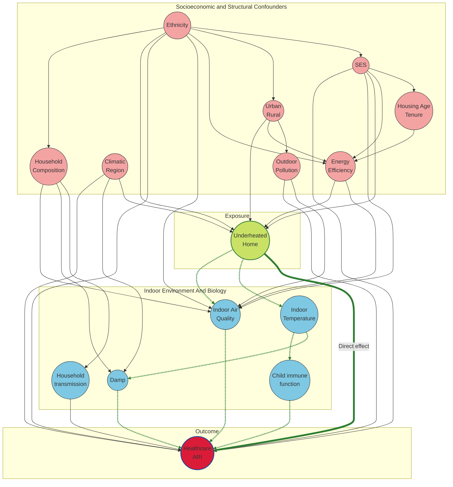
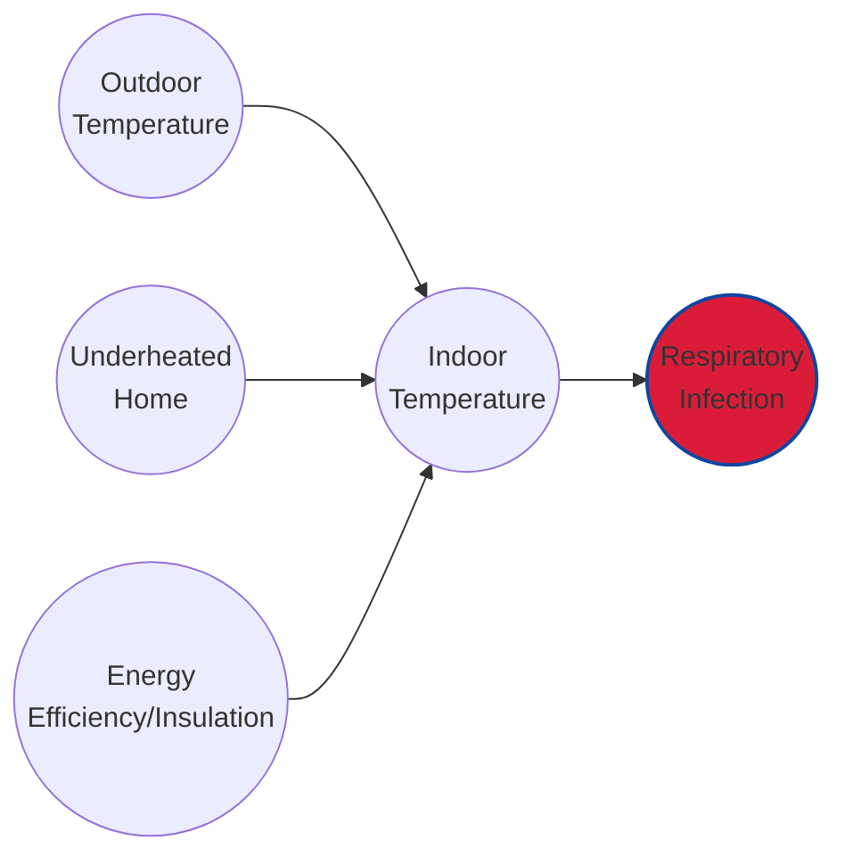
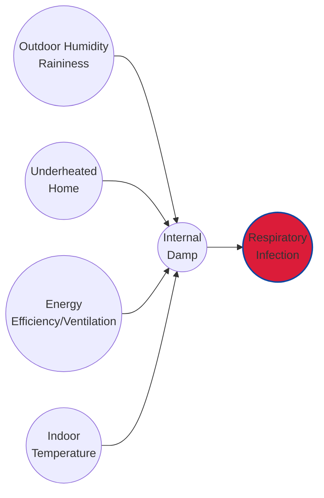
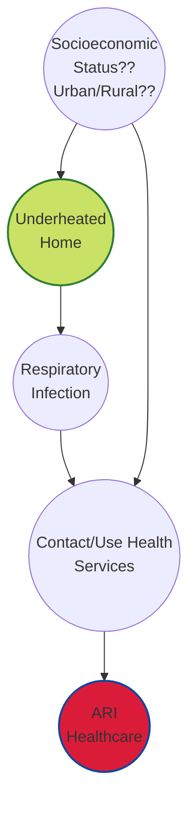

## Acute Respiratory Infection - Causal Diagram
Causal Diagram for Acute Respiratory Infections in housing taking us from exposure to living in an underheated home to an Acute Respiratory Infection.
* Exposure = Underheated home
* Outcome = Healthcare for ARI
* Red nodes = confounders to adjust for
* Blue nodes = other nodes on the pathway (no adjustment)
* Green arrows = direct effect of exposure on outcome

```mermaid
graph TD

%% =========================
%% Subgraphs
%% =========================

subgraph Socioeconomic_and_Structural[Socioeconomic and Structural Confounders]
    SES((SES))
    Ethnicity((Ethnicity))
    Housing_age_tenure((Housing Age<br>Tenure))
    Energy_efficiency((Energy<br>Efficiency))
    Urban_rural((Urban<br>Rural))
    Climatic_region((Climatic<br>Region))
    Household_composition((Household<br>Composition))
    Outdoor_AP((Outdoor<br>Pollution))
end

subgraph Indoor_Environment_and_Biology[Indoor Environment And Biology]
    Indoor_air_quality((Indoor Air<br>Quality))
    Indoor_temp((Indoor<br>Temperature))
    Damp((Damp))
    Child_immune_function((Child immune<br>function))
    Household_transmission((Household<br>transmission))
end

subgraph Exposure
    Underheated_home((Underheated<br>Home))
end

subgraph Outcome
    Healthcare_ARI((Healthcare<br>ARI))
end

%% =========================
%% Structural pathways
%% =========================


SES --> Housing_age_tenure
SES --> Energy_efficiency
SES --> Underheated_home
SES --> Indoor_air_quality
SES --> Healthcare_ARI

Ethnicity --> SES
Ethnicity --> Urban_rural
Ethnicity --> Energy_efficiency
Ethnicity --> Indoor_air_quality
Ethnicity --> Healthcare_ARI
Ethnicity --> Underheated_home
Ethnicity --> Household_composition

Housing_age_tenure --> Energy_efficiency

Energy_efficiency --> Indoor_air_quality
Energy_efficiency --> Underheated_home

Urban_rural --> Outdoor_AP
Urban_rural --> Energy_efficiency
Urban_rural --> Underheated_home


Climatic_region --> Underheated_home
Climatic_region --> Damp
Climatic_region --> Healthcare_ARI

Outdoor_AP --> Indoor_air_quality
Outdoor_AP --> Healthcare_ARI

Household_composition --> Household_transmission
Household_composition --> Damp
Household_composition --> Indoor_air_quality

Household_transmission --> Healthcare_ARI

%% =========================
%% Mediated (indirect) pathways
%% =========================

Indoor_air_quality -.-> Healthcare_ARI

Indoor_temp -.-> Damp
Indoor_temp -.-> Child_immune_function

Child_immune_function -.-> Healthcare_ARI

Damp -.-> Healthcare_ARI

%% =========================
%% Highlighted causal pathway
%% =========================

Underheated_home -->|Direct effect| Healthcare_ARI


Underheated_home -.-> Indoor_temp
Underheated_home -.-> Indoor_air_quality

%% =========================
%% Styling
%% =========================

classDef structural fill:#f4a3a3,stroke:#333,stroke-width:1px;
classDef indoor fill:#7ec8e3,stroke:#333,stroke-width:1px;
classDef exposure fill:#c9e265,stroke:#2e7d32,stroke-width:2px;
classDef outcome fill:#db1c39,stroke:#0d47a1,stroke-width:2px;

class Outdoor_AP,SES,Ethnicity,Housing_age_tenure,Energy_efficiency,Urban_rural,Climatic_region,Household_composition structural;
class Indoor_air_quality,Indoor_temp,Damp,Child_immune_function,Household_transmission indoor;
class Underheated_home exposure;
class Healthcare_ARI outcome;

%% Edge styling (green causal pathway)
linkStyle 32 stroke:#2e7d32,stroke-width:5px;
linkStyle 29 stroke:#2e7d32,stroke-width:3px;
linkStyle 27 stroke:#2e7d32,stroke-width:3px;
linkStyle 30 stroke:#2e7d32,stroke-width:3px;
linkStyle 31 stroke:#2e7d32,stroke-width:3px;
linkStyle 28 stroke:#2e7d32,stroke-width:3px;
linkStyle 33 stroke:#2e7d32,stroke-width:3px;
linkStyle 34 stroke:#2e7d32,stroke-width:3px;
```

## Questions about the DAG

### What is climatic region and how does it influence ARI admissions?

I think climatic region is actually outdoor temperature/weather and we should produce  "separate" pathways for damp.

```mermaid
graph LR


OutdoorTemperature(("Outdoor<br>Temperature"))
UnderheatedHome(("Underheated<br>Home"))
EnergyEfficiency(("Energy<br>Efficiency/Insulation"))
InternalTemperature(("Indoor<br>Temperature"))
RespiratoryInfection(("Respiratory<br>Infection"))

OutdoorTemperature --> InternalTemperature
UnderheatedHome --> InternalTemperature
EnergyEfficiency --> InternalTemperature
InternalTemperature --> RespiratoryInfection

classDef outcome fill:#db1c39,stroke:#0d47a1,stroke-width:2px;
class RespiratoryInfection outcome;
```

```mermaid
graph LR
OutdoorHumidity(("Outdoor Humidity<br>Raininess"))
UnderheatedHome(("Underheated<br>Home"))
EnergyEfficiency(("Energy<br>Efficiency/Ventilation"))
Damp(("Internal<br>Damp"))
RespiratoryInfection(("Respiratory<br>Infection"))
InternalTemperature(("Indoor<br>Temperature"))

OutdoorHumidity --> Damp
UnderheatedHome --> Damp
EnergyEfficiency --> Damp
InternalTemperature --> Damp
Damp-->RespiratoryInfection


classDef outcome fill:#db1c39,stroke:#0d47a1,stroke-width:2px;
class RespiratoryInfection outcome;
```

### Healthcare Admission for ARI
I think the pathway for Healthcare ARI is slightly more involved than shown on the causal graph. If a child has a respiratory infection, then the parents must decide to contact the health services. That decision is likely to be influenced by a lot of factors. For example, ethnicity, socioeconomic status, tenure or rural/urban living may be factors which influence the decision to contact the healthcare services. So, for example, An owner/occupier may be more likely to be registered with a GP and, thus, more likely to contact the GP. Some of these pathways already exist in the top graph, but it may be a clearer to think of it this way. A big question is whether this may have the potential to cause problems with any analysis? 

```mermaid
graph TB
RespiratoryInfection(("Respiratory<br>Infection"))
ContactHealthServices(("Contact/Use Health<br>Services"))
HealthcareForARI(("ARI<br>Healthcare"))
UnderheatedHome(("Underheated<br>Home"))
SES(("Socioeconomic<br>Status??<br>Urban/Rural??"))

UnderheatedHome --> RespiratoryInfection
RespiratoryInfection --> ContactHealthServices
ContactHealthServices --> HealthcareForARI
SES --> ContactHealthServices
SES --> UnderheatedHome

classDef outcome fill:#db1c39,stroke:#0d47a1,stroke-width:2px;
classDef exposure fill:#c9e265,stroke:#2e7d32,stroke-width:2px;

class HealthcareForARI outcome;
class UnderheatedHome exposure;
```

