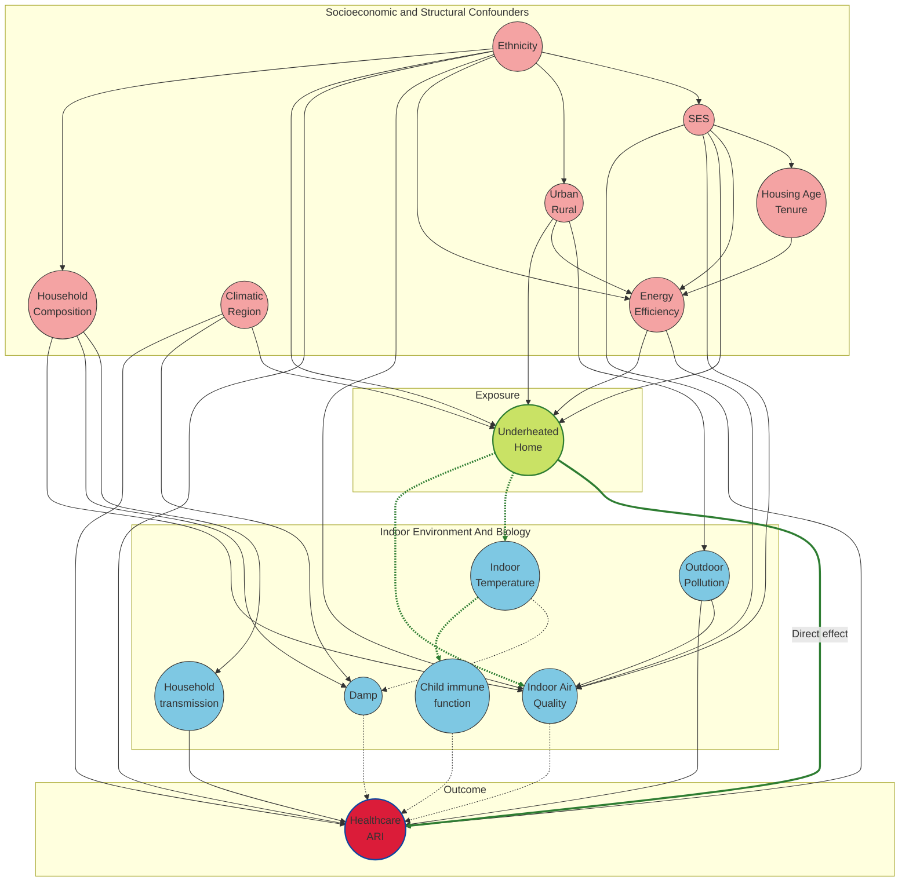

## Acute Respiratory Infection - Causal Diagram
Causal Diagram for Acute Respiratory Infections in housing taking us from exposure to living in an underheated home to an Acute Respiratory Infection.

