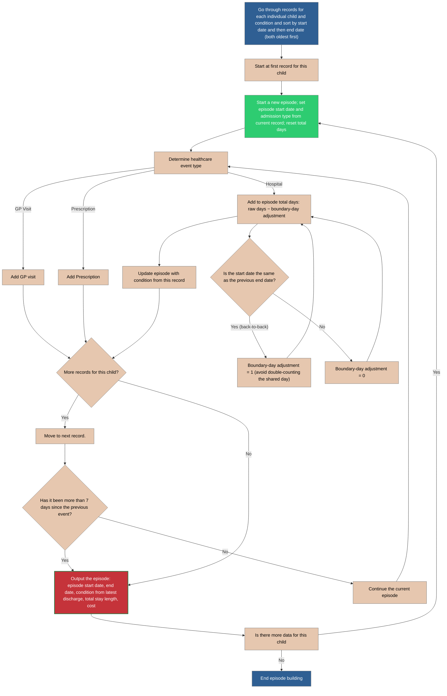

# Episode Builder
There are many events that are close together. For example, hospital admissions often show multiple admissions for a single child. Events will be considered a single Episode if there is a previous event within the last 7 days. The first event date will be the date when the episode is considered to have occurred. Total Day count will be summed up for the overlapping records. Diagnosis codes will not necessarily be the same for the different admissions, but they will be considered to be the same condition (clinical subcategory?). The diagnosis codes will be the diagnosis codes for the last discharge record. 

**Goal**: Group events of the same patient and same condition into episodes, where any gap between consecutive events in an episode is at most max_gap_days (default 7). Episodes can be longer than 7 days; the 7 days limit applies to the gap between events, not the total episode length.
### Events:
*    **GP visit**: single-day event.
*    **Prescription**: single-day event with a cost and product identifier.
*    **Hospital admission**: multi-day event with start_date and end_date.
 
Episode outputs per patient + condition:

**Normalisation**: Convert input tables into a single Healthcare Events table with unified schema:
* **ppid** - Unique child ID
* **eventid** - Unique ID assigned to event
* **condition_code** - ARI/Chronic Condition - How do we categorise this condition? Prescription does not have the fine grain details that other categories have, but are prescriptions always associated with GP Visits. Let's seee
* **event_start_date** - date of first healthcare incident
* **event_end_date** - end of last healthcare incident in episode
* **num_prescriptions** - number of prescriptions used by child over all episodes
* **num_gp_visits** - number of gp visits over episode
* **num_hospital_visits** - number of hospital visits during episode
* **num_hospital_days** - number of days spent in hospital during episode
* **cost** - total cost of episode = cost of prescriptions + gp_visits * cost_of_gp_visit  + cost_of_hospital_per_day * num_hospital_days
### Key Business Rules

**Partitioning**: Build episodes independently per patient_id and condition_code.

**Gap rule**: A new event belongs to the current episode if event.start_date <= current_episode_end + max_gap_days. Otherwise, close the episode and start a new one. Default max_gap_days = 7.

**Episode window expansion**: When adding an event, extend current_episode_end = max(current_episode_end, event.end_date). Hospital admissions can extend episodes forward.

**Same-day/back-to-back**:
*   If event start date <= current episode end, it is within the episode (overlap).
*   If event start date is exactly current episode end + 1 (.e., no full-day gap), still within episode because gap = 1 <= 7.

**Hospital day counting**:
* Parameter day_count_mode:
        inclusive_days: hospital_days = (end_date - start_date) + 1
            nights_only: hospital_days = (end_date - start_date)
* Costs: Sum per prescription record’s cost within the episode. 

### Combining Admissions
Flow chart showing how to combine hospital admissions.

