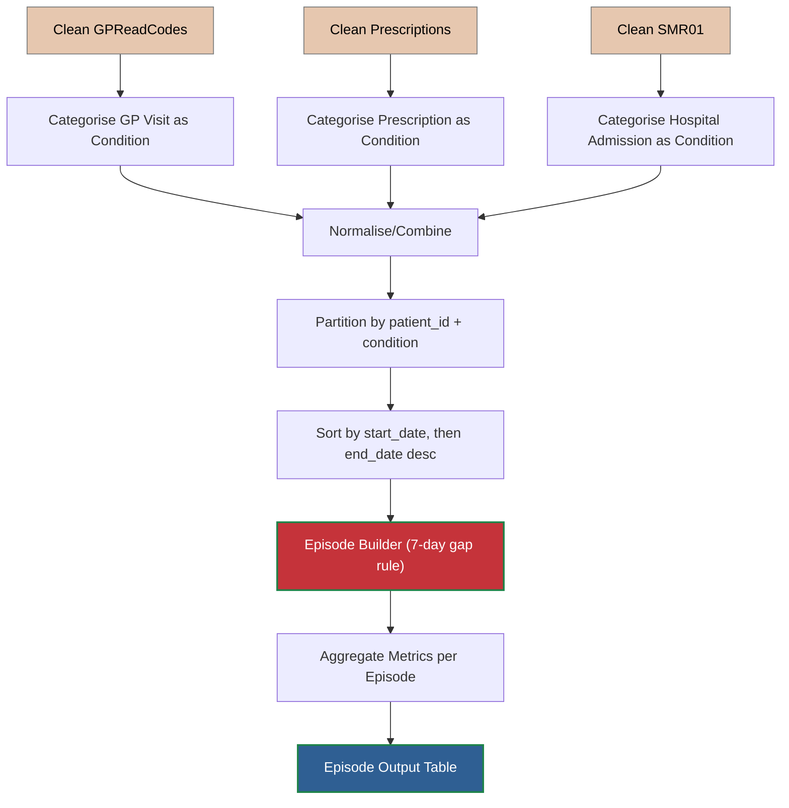

# Assignment of Healthcare Records
This document deals with the assignment of healthcare records to a particular condition. There are three input tables of healthcare records:
1. **SMR01** - Hospital Admission Records
        - patient_id, condition_codes, admission_date, discharge_date
2. **GPReadCodes** - GP Read codes after GP attendance
        - patient_id, Read code, visit_date
3. **Prescriptions** - Each prescription of Salbutamol, Clarithromycin, or Amoxicillin
        - patient_id, prescription_name, dispensed_date

These records will be processed into single healthcare episodes combining GP visits, Hospital Admissions and Prescriptions using the following high-level process. Each individual GP Visit, Prescription and Hospital Admission will be categorised using the process at the [categorisation](ari_categorise.md). Episodes will be built using the [Episode Builder](ari_episodes.md).

## High-level process

**Normalisation**: Convert input tables into a single Healthcare Events table with unified schema:
* **ppid** - Unique child ID
* **condition_code** - ARI/Chronic Condition - How do we categorise this condition? Prescription does not have the fine grain details that other categories have, but are prescriptions always associated with GP Visits. Let's seee
* **event_start_date** - date of first healthcare incident
* **event_end_date** - end of last healthcare incident in episode
* **num_prescriptions** - number of prescriptions used by child over all episodes
* **num_gp_visits** - number of gp visits over episode
* **num_hospital_visits** - number of hospital visits during episode
* **num_hospital_days** - number of days spent in hospital during episode
* **cost** - total cost of episode = cost of prescriptions + gp_visits * cost_of_gp_visit  + cost_of_hospital_per_day * num_hospital_days

