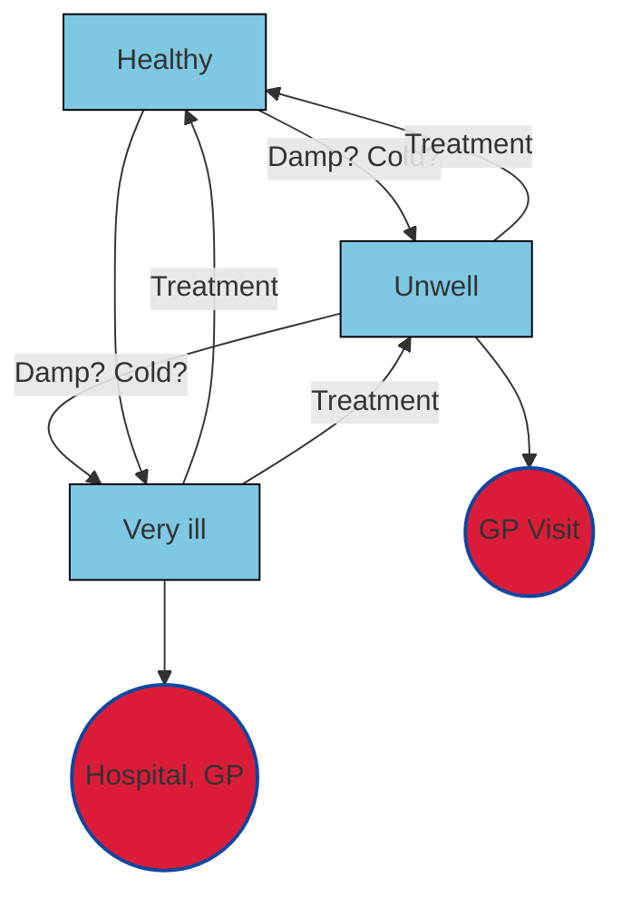

```mermaid
flowchart TB
Healthy["Healthy"] --> |Damp? Cold?| Unwell["Unwell"]
Unwell --> |Damp? Cold?|Very_ill["Very ill"]
Very_ill --> |Treatment| Healthy
Unwell --> |Treatment| Healthy
Very_ill --> |Treatment| Unwell
Healthy --> Very_ill

Unwell --> GP(("GP Visit"))
Very_ill --> Hospital(("Hospital, GP"))


classDef hmm_node fill: #7ec8e3,stroke: #000,stroke-width:1px;
classDef mediator fill: #7ec8e3,stroke:#333,stroke-width:1px;
classDef exposure fill: #c9e265,stroke:#2e7d32,stroke-width:2px;
classDef outcome fill:#db1c39,stroke:#0d47a1,stroke-width:2px;

class Healthy,Unwell,Very_ill hmm_node;
class Indoor_Environment,Susceptibility_Transmission mediator;
class Underheated_Home exposure;
class GP,Hospital outcome;


```