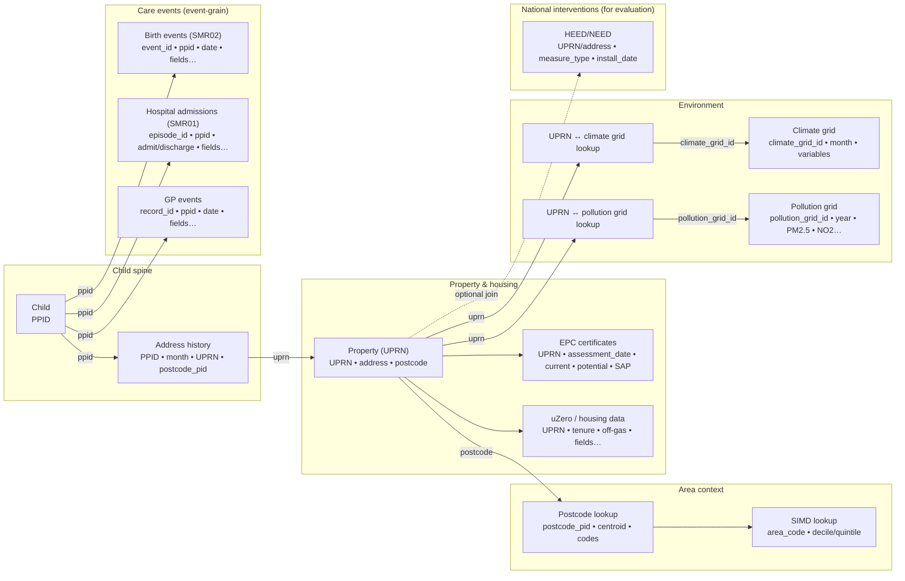

Data linkage plan:

```mermaid
flowchart LR
  %% Roles/areas
  subgraph CHILD["Child spine"]
    C["Child<br/>PPID"]
    AH["Address history<br/>PPID • month • UPRN • postcode_pid"]
  end

  subgraph EVENTS["Care events (event-grain)"]
    B["Birth events (SMR02)<br/>event_id • ppid • date • fields…"]
    H["Hospital admissions (SMR01)<br/>episode_id • ppid • admit/discharge • fields…"]
    G["GP events<br/>record_id • ppid • date • fields…"]
  end

  subgraph PROPERTY["Property & housing"]
    U["Property (UPRN)<br/>UPRN • address • postcode"]
    EPC["EPC certificates<br/>UPRN • assessment_date • current • potential • SAP"]
    UZ["uZero / housing data<br/>UPRN • tenure • off-gas • fields…"]
  end

  subgraph AREA["Area context"]
    PC["Postcode lookup<br/>postcode_pid • centroid • codes"]
    SIMD["SIMD lookup<br/>area_code • decile/quintile"]
  end

  subgraph ENV["Environment"]
    CGRID["Climate grid<br/>climate_grid_id • month • variables"]
    PGRID["Pollution grid<br/>pollution_grid_id • year • PM2.5 • NO2…"]
    CLU["UPRN ↔ climate grid lookup"]
    PLU["UPRN ↔ pollution grid lookup"]
  end

  subgraph NATIONAL["National interventions (for evaluation)"]
    HEED["HEED/NEED<br/>UPRN/address • measure_type • install_date"]
  end

  %% Linkage edges
  C -->|ppid| B
  C -->|ppid| H
  C -->|ppid| G
  C -->|ppid| AH

  AH -->|uprn| U
  U --> EPC
  U --> UZ
  U -->|postcode| PC
  PC --> SIMD

  U -->|uprn| CLU -->|climate_grid_id| CGRID
  U -->|uprn| PLU -->|pollution_grid_id| PGRID

  U -. optional join .-> HEED

  %% Notes
  classDef note fill:#fff6,stroke:#bbb,color:#333,stroke-dasharray:3 3;

```