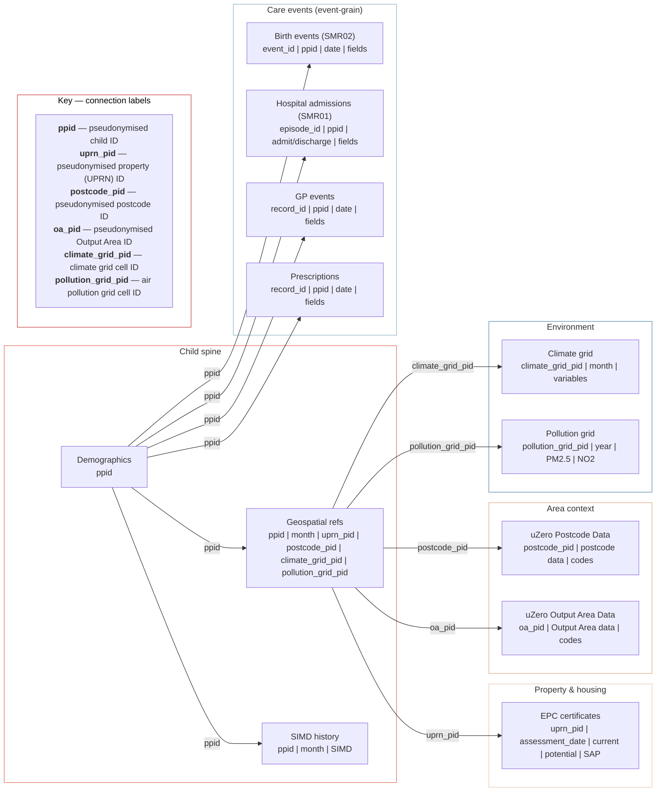

## Data linkage plan:

```mermaid
flowchart LR


 subgraph CHILD["Child spine"]
        C["Demographics<br>ppid"]
        AH["Geospatial refs<br>ppid | month | uprn_pid | postcode_pid | climate_grid_pid | pollution_grid_pid"]
        SH["SIMD history<br>ppid | month | SIMD"]
  end
 subgraph EVENTS["Care events (event-grain)"]
        B["Birth events (SMR02)<br>event_id | ppid | date | fields"]
        H["Hospital admissions (SMR01)<br>episode_id | ppid | admit/discharge | fields"]
        G["GP events<br>record_id | ppid | date | fields"]
        P["Prescriptions<br>record_id | ppid | date | fields"]
  end
 subgraph PROPERTY["Property & housing"]
        EPC["EPC certificates<br>uprn_pid | assessment_date | current | potential | SAP"]
  end
 subgraph AREA["Area context"]
        PC["uZero Postcode Data<br>postcode_pid | postcode data | codes"]
        OAC["uZero Output Area Data<br>oa_pid | Output Area data | codes"]
  end
 subgraph ENV["Environment"]
        CGRID["Climate grid<br>climate_grid_pid | month | variables"]
        PGRID["Pollution grid<br>pollution_grid_pid | year | PM2.5 | NO2"]
  end
    subgraph KEY["Key — connection labels"]
    direction TB
      L["<b>ppid</b> — pseudonymised child ID<br/><b>uprn_pid</b> — pseudonymised property (UPRN) ID<br/><b>postcode_pid</b> — pseudonymised postcode ID<br/><b>oa_pid</b> — pseudonymised Output Area ID<br/><b>climate_grid_pid</b> — climate grid cell ID<br/><b>pollution_grid_pid</b> — air pollution grid cell ID"]
 end
    C -- ppid --> B & H & G & P & AH & SH
    AH -- oa_pid --> OAC
    AH -- uprn_pid --> EPC
    AH -- postcode_pid --> PC
    AH -- climate_grid_pid --> CGRID
    AH -- pollution_grid_pid --> PGRID
   
    style ENV stroke: #4E86AD, fill: #fff
    style EVENTS stroke:  #86AFC4, fill: #fff
    style PROPERTY stroke: #E6C7AF, fill: #fff
    style AREA stroke: #E9A27D, fill: #fff
    style CHILD stroke: #D96A4C, fill: #fff
    style KEY fill: #fff, stroke: #C5333A, color: #000
```