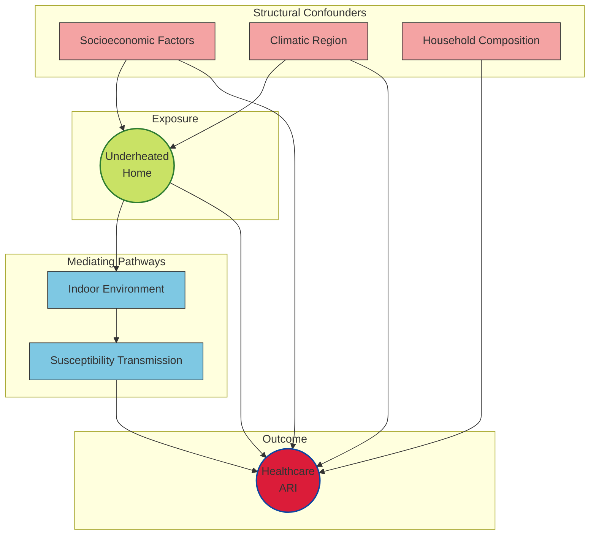

## Simplified DAG
This is a simplified version of the Causal Diagram for Acute Respiratory Infections that shows the pathway between exposure to an underheated home
and an Acute Respiratory Infection. This diagram helps us to decide which variables are potential confounders and should be adjusted for in any 
analysis of the data.

